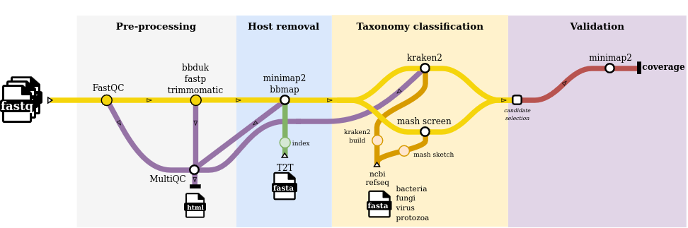

# zhodiag: Ze shotgun metagenomics pipeline for diagnostics

## How to use:

### Pre-requisites
A conda environment with nextflow version 24.10.5 (other versions not tested.). You can find a working environment called `vcs_nextflow_24.10.5` in asterix:

```
conda activate vcs_nextflow_24.10.5
```

### Usage
1. Clone the repo
2. Prepare input sample table. This is a comma-separated table with the following columns:
    `sample,fastq_1,fastq_2,group`. You can see an example in `data/example_groups.csv`

* sample: sample name. This will prefix all files.
* fastq_1 and fastq_2: full path to R1 and R2 reads.
* group: variable used in final plots. You will need at least two groups for the plots to work. A "control" group is useful.

3. Edit `nextflow.config` with parameters of choice. The current config works, so you should *not need to change anything*. 
Minimap2 to fpv (fungi/protozoa/virus from refseq). Minimap2 to pandb currently not working (due to duplicated headers). Kraken to fpv and/or bacteria.

4. Run (with -resume if re-launching):

```
nextflow run main.nf -profile singularity --input data/example_groups.csv --outdir OUTPUT -resume
```


## Diagram (not up-to-date)


