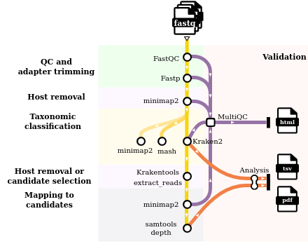

# zhodiag: Ze shotgun metagenomics pipeline for diagnostics


## Pipeline overview



## How to use:

### Pre-requisites
A conda environment with nextflow version 24.10.5 (other versions not tested.). You can find a working environment in asterix:

```
conda activate vcs_nextflow_24.10.5
```

### Usage
1. Clone the repo.
2. Prepare input sample table. This is a comma-separated table with the following columns:
    `sample,fastq_1,fastq_2,group`. You can see an example in `data/example_groups.csv`

* sample: sample name. This will prefix all files.
* fastq_1 and fastq_2: full path to R1 and R2 reads.
* group: variable used for faceting in output plots. For control samples, use "control" as group.

3. Edit `nextflow.config` with parameters of choice. 

* You can optionally run taxonomy classification with kraken2/mash and/or mapping to kingdoms with minimap2 by turning on/off (true/false) the corresponding processes.
* Minimap2 uses a reference fasta or mmi index of your choice. Kraken2 used a db of your choice. 
* In the output plots generated, you can optionally remove known contaminants by providing a tab-delimited, header-less table with taxIDs and contaminat names (only taxIDs are used) using the parameter "contaminants". This create a set of plots without the selected taxIDs in addition to the set of plots with all taxIDs. Leave empty ('') if you don't want to remove any taxID.
* The plots can be generated at the taxonomic level of choice (parameter "taxonomy_level")

4. Run (with -resume if re-launching):

```
nextflow run main.nf -profile singularity --input data/example_groups.csv --outdir OUTPUT -resume
```

## Output
The output will be organised by software, for example:

* fastqc: output of qc control step.
* fastp: output of trimming step, including cleaned-reads fastq files and log files.
* minimap2: output of all mapping steps. The "host" subdirectory contains output files after removing human-mapping reads. The rest of the folder contains output of mapping to the provided reference fasta. All mapping steps include flagstat log files and bam files. Reference-mapping step include paf files. 
* kraken2: output of kraken2 classification, including output and report files.
* mash: output of classification with mash.
* plots_and_tables: includes summary tables derived from kraken2 and minimap2 processes, as well as relevant result plots. The tables are the input to generate all plots and can be used to manually genereate any downstream plot of interest.
* pipeline_info: nextflow run logs.


