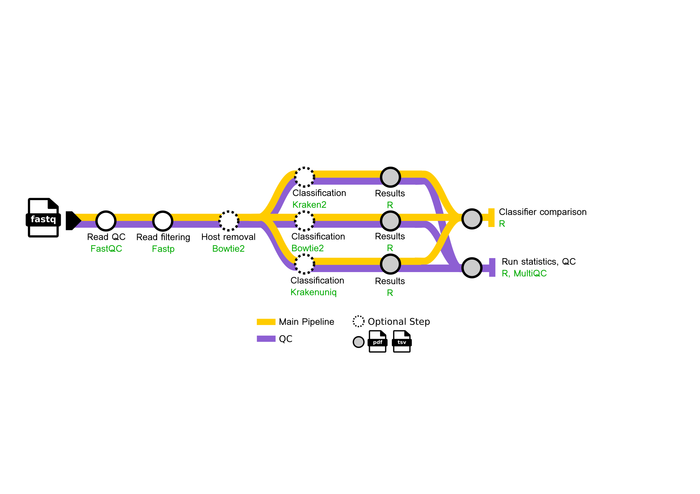

# :milky_way: zhodiag: ze shotgun metagenomics pipeline for diagnostics


## :telescope: Pipeline overview




## :microscope: How to use:

### :stars: Pre-requisites
A conda environment with nextflow version 24.10.5 (other versions not tested.). You can find a working environment in asterix and obelix:

```
conda activate vcs_nextflow_24.10.5
```

### :rocket: Usage
1. Clone the repo.
2. Prepare input sample table. This is a comma-separated table with the following columns:
    `sample,fastq_R1,fastq_R2,group`. You can see an example in `data/simdata1.tsv`

* sample: sample name. Unique. This will prefix all output files.
* fastq_R1 and fastq_R2: full path to R1 and R2 reads.
* group: variable used for faceting in output plots. *For negative control samples, use "control" as group*.

3. Edit `nextflow.config` with parameters of choice:

* `host_removal` (true/false): whether to run a bowtie2-based host-removal step prior to taxonomy classification. In any case, human reads will be detected at the classification step. If true, the host fasta and bowtie2 index are required (`host_fasta, host_bowtie2_index`).
* `run_mapping, run_kraken2, run_krakenuniq` (true/false): You can optionally run taxonomy classification with kraken2 and/or krakenuniq and/or by mapping with bowtie2. 
* Currently, kraken2 can run with our custom fulldb or with a downloaded db (requires `kraken2_db`) and you can provide a confidence parameter (`kraken2_confidence`). Krakenuniq runs only with the downloaded [MicrobialDB](https://benlangmead.github.io/aws-indexes/k2) (we couldn't compile our custom db into a krakenuniq index) (requires `krakenuniq_db`). Classification by mapping is run with our custom full db, or you can create a different bowtie2 index (requires `reference_fasta, reference_bowtie2_index` and additional filtering parameters `mapq_cutoff, coverage_cutoff`).
* `contaminants` (path): You can prepare a table file containing known contaminants that you want removed from plots (eg. Bradyrhyzobiums, Cutibacterium acnes, etc). The file is a header-less tsv and has two columns: first column is the taxonomy. This can be a species name, a genus name, or a taxID. The second column specifies whether the first column is a "species", a "genus", or a "taxid". The species named exactly as writen in the file will be removed. All species starting by the genus as writen in the file will be removed. Taxa specified by the taxID will also be removed. See an example file in `data/contaminants.tsv`.
* `min_reads` (integer): Taxa with less than min_reads will be removed from plots. 

4. Run (with -resume if re-launching):

```
nextflow run main.nf -profile singularity --input data/simdata1.tsv --contaminants path/to/data/contaminants.tsv -resume
```

## :fireworks: Output
The output will be organised by software, for example:

* fastqc: output of qc control step.
* fastp: output of trimming step, including cleaned-reads fastq files and log files.
* bowtie2: output of all mapping steps (host, mapping-based classification).
* kraken2: output of kraken2 classification, including output and report files.
* krakenuniq: output of krakenuniq classification, including output and report files.
* plots_and_tables: includes summary tables derived from kraken2, krakenuniq and mapping-based classification processes, as well as relevant result plots. The plots include a heatmap with all samples in the run, and heatmaps generated for each sample vs control and for each group vs control, where the cell number indicates the number of reads and the fill colour indicates coverage. Heatmaps are sorted by taxa abundance. There is also a scatterplot of reads vs coverage for each sample. Tables include the original table used to generate all plots (`..._combined.tsv`), a table at species level before and after filtering, a summary of number of reads by kingdoms, and the contaminant reads removed per sample.

Moreover, a stats_report table and plot are also generated, containing relevant statistics on number of reads mapped, classified, and filtered at each step, as well as the number of taxa detected (before and after filtering).
* pipeline_info: nextflow run logs.


