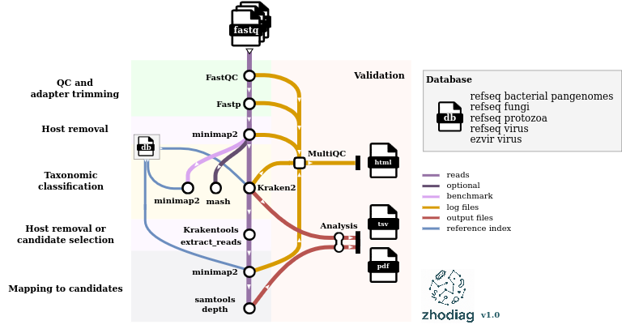

# :milky_way: zhodiag: Ze shotgun metagenomics pipeline for diagnostics


## :telescope: Pipeline overview

Diagram is not up-to-date




## :microscope: How to use:

### :stars: Pre-requisites
A conda environment with nextflow version 24.10.5 (other versions not tested.). You can find a working environment in asterix and obelix:

```
conda activate vcs_nextflow_24.10.5
```

### :rocket: Usage
1. Clone the repo.
2. Prepare input sample table. This is a comma-separated table with the following columns:
    `sample,fastq_R1,fastq_R2,group`. You can see an example in `data/samples.csv`

* sample: sample name. This will prefix all files.
* fastq_R1 and fastq_R2: full path to R1 and R2 reads.
* group: variable used for faceting in output plots. For control samples, use "control" as group.

3. Edit `nextflow.config` with parameters of choice. Follow the recomended tools for full functionality (other tools not fully implemented yet)

* Recommended trimmer is fastp (option `trim_tool`).
* Recommended mapper is bowtie2 (option `mapper`). Bowtie2 requires the reference index and fasta. 
* You can optionally run taxonomy classification with kraken2/krakenuniq by turning on/off (true/false) the corresponding processes. 
* Currently, kraken2 is running with our fulldb, whereas krakenuniq runs with the premade MicrobialDB.
* After taxonomy assignation, the classified reads can be extracted (option `map_classified` true). You need to choose which classified reads to extract (kraken2 or krakenuniq, depending on which classifier you used, option `which_classified`)


4. Run (with -resume if re-launching):

```
nextflow run main.nf -profile singularity --input data/example_groups.csv --outdir OUTPUT -resume
```

## :fireworks: Output
The output will be organised by software, for example:

* fastqc: output of qc control step.
* fastp: output of trimming step, including cleaned-reads fastq files and log files.
* bowtie2: output of all mapping steps (host, and optionally, post-classification mapping).
* kraken2: output of kraken2 classification, including output and report files.
* krakenuniq: output of krakenuniq classification, including output and report files.
* plots_and_tables: includes summary tables derived from kraken2, krakenuniq and post-classification mapping processes, as well as relevant result plots. 
A stats_report table is also generated, containing relevant statistics on number of reads mapped, classified, and filtered at each step.
* pipeline_info: nextflow run logs.


